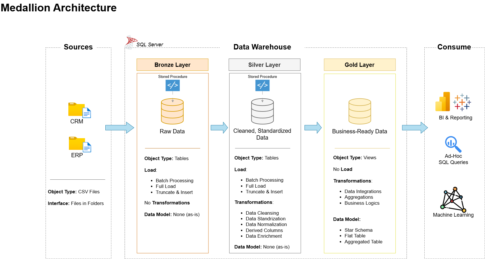

# DataWarehouseProject
Welcome to the **Data Warehouse and Analytics Project** repository! 🚀  
# This is my sql data warehouse project for my portfolio : the goal is to build a datawarehouse with ETL processing , data modeling and analytics.
---
## 🏗️ Data Architecture

The data architecture for this project follows Medallion Architecture **Bronze**, **Silver**, and **Gold** layers:


1. **Bronze Layer**: Stores raw data as-is from the source systems. Data is ingested from CSV Files into SQL Server Database.
2. **Silver Layer**: This layer includes data cleansing, standardization, and normalization processes to prepare data for analysis.
3. **Gold Layer**: Houses business-ready data modeled into a star schema required for reporting and analytics.

---
## 📖 Project Overview

This project involves:

1. **Data Architecture**: Designing a Modern Data Warehouse Using Medallion Architecture **Bronze**, **Silver**, and **Gold** layers.
2. **ETL Pipelines**: Extracting, transforming, and loading data from source systems into the warehouse.
3. **Data Modeling**: Developing fact and dimension tables optimized for analytical queries.
4. **Analytics & Reporting**: Creating SQL-based reports and dashboards for actionable insights.


---

## 🛠️ Important Links & Tools:

Everything is for Free!
- **[Datasets](datasets/):** Access to the project dataset (csv files).
- **[SQL Server](https://www.microsoft.com/en-us/sql-server/sql-server-downloads):** for hosting SQL database.
- **[SQL Server Management Studio (SSMS)](https://learn.microsoft.com/fr-fr/ssms/download-sql-server-management-studio-ssms):** GUI for managing and interacting with databases.
- **[Git Repository](https://github.com/):** Set up a GitHub account and repository to manage, version, and collaborate on code efficiently.
- **[DrawIO](https://www.drawio.com/):** Design data architecture, models, flows, and diagrams.
- **[Notion Project Steps](https://www.notion.so/Portfolio-DW-project-1a37a525421b800cadc6edffc36b31dc?pvs=4):** Access to All Project Phases and Tasks.
- 
---

## 🚀 Project Requirements

### Building the Data Warehouse 

#### 🎯 Objective
Develop a modern data warehouse using SQL Server to consolidate sales data, enabling analytical reporting and informed decision-making.

#### Specifications
- **Data Sources**: Import data from two source systems (ERP and CRM) provided as CSV files.
- **Data Quality**: Cleanse and resolve data quality issues prior to analysis.
- **Integration**: Combine both sources into a single, user-friendly data model designed for analytical queries.
- **Scope**: Focus on the latest dataset only; historization of data is not required.
- **Documentation**: Provide clear documentation of the data model to support both business stakeholders and analytics teams.

---

### BI: Analytics & Reporting (Data Analysis)

#### Objective
Develop SQL-based analytics to deliver detailed insights into:
- **Customer Behavior**
- **Product Performance**
- **Sales Trends**

These insights empower stakeholders with key business metrics, enabling strategic decision-making.  

For more details, refer to [mydocuments/requirements.md](mydocuments/requirements.md).

## 📂 Repository Structure
```
Data warehouse sql project/
│
├── datasets/                                      # Raw datasets used in the project (ERP and CRM sources)
│  ├── source_crm                                   # Data from the CRM system
│  ├── source_erp                                   # Data from the ERP system
│
├── mydocuments/                                   # Project documentation and architecture diagrams
│   ├── data catalog.md                             # Dataset catalog including field descriptions and metadata         
│   ├── data integration diagram.drawio             # Source file for the data integration diagram (created in Draw.io)
│   ├── data integration diagram.png                # Exported image of the data integration diagram
│   ├── data_architecture.drawio                    # Draw.io file showing the overall data warehouse architecture
│   ├── data_architecture.png                       # Exported image of the data architecture diagram
│   ├── data_flow_diagram.drawio                    # Draw.io file for data flow diagram
│   ├── data_flow_diagram.png                       # Exported image of the data flow diagram
│   ├── data_model_diagram(start_schema).drawio     # Star schema data model (Draw.io source file)
│   ├── data_model_diagram(start_schema).png        # Exported image of the star schema data model
│   ├── naming-conventions.md                       # Guidelines for consistent naming of tables, columns, and files
│
├── scripts/                                        # SQL scripts for ETL process and data transformations
│   ├── bronze/                                     # Scripts for raw data ingestion (from source to staging/bronze layer)
│   ├── silver/                                     # Scripts for cleaned and transformed data (intermediate/silver layer)
│   ├── gold/                                       # Scripts for building analytical models (final/gold layer)
│   ├── init_DW_Sales.sql                           # Initial SQL script to create the data warehouse sales structure
│
├── the details transformations and test/           # Detailed transformation scripts and test/quality validation files
│   ├── gold/                                       # Gold layer transformations with related test.
│   ├── silver/                                     # Silver layer transformations with related test.
│
├── README.md                                       # Project overview, setup instructions, and usage guide
├── LICENSE                                         # Licensing information for open-source or distribution
├── .gitignore                                      # Git ignored files and folders (e.g., temp files, environment configs)
└── requirements.md                                 # List of dependencies, tools, and requirements needed for the project

```
---
---

## 🛡️ License

This project is licensed under the [MIT License](LICENSE). You are free to use, modify, and share this project with proper attribution.

## 🌟 About Me

Hi there! I'm **Kaouter RHAZLANI**.  
I’m a **Data Engineer** passionate about building efficient data pipelines, transforming raw data into meaningful insights, and contributing to data-driven solutions.

Feel free to connect with me on:

[](https://www.linkedin.com/in/kaouter-rhazlani)


